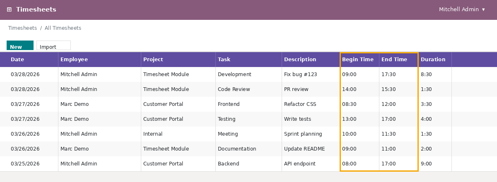
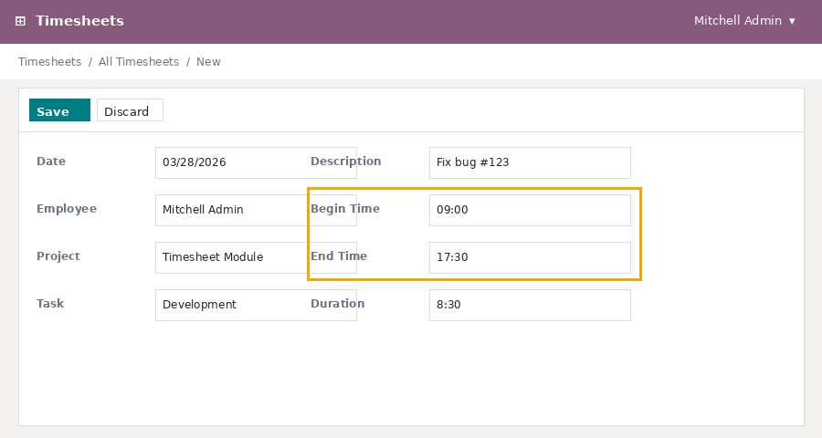
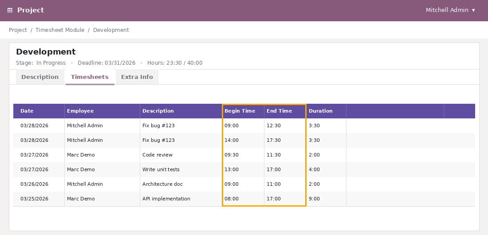

After installing this module, two new fields become available on every
timesheet entry: **Begin Time** and **End Time**. These fields display the
start and end times of a work session in the employee's local timezone and
keep the underlying `date_time` / `date_time_end` datetime fields
synchronized automatically.

## Timesheet List View

The **Begin Time** and **End Time** columns are
shown by default and can be toggled like any other optional column.

## Timesheet Form View

**Duration** field. Entering a **Begin Time** and **End Time** automatically
recalculates the duration.

## Project Task – Inline Timesheet View

Inside a project task the inline timesheet list also exposes the **Begin
Time** and **End Time** columns, making it easy to review the exact work
intervals logged against a task without leaving the task form.

