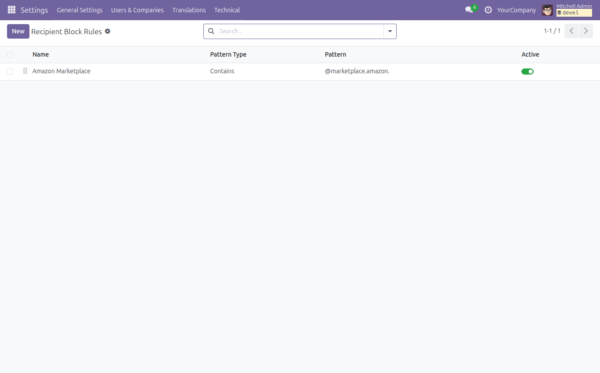
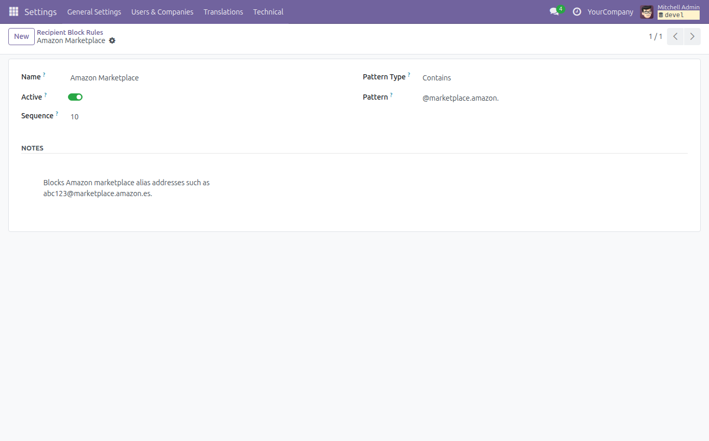
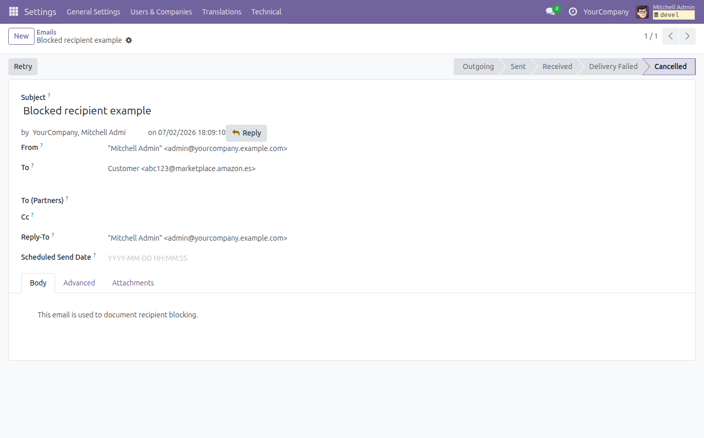

To configure blocked recipients:

1. Go to **Settings > Technical > Email > Recipient Block Rules**.

   

2. Create a new rule or edit an existing one. For each rule, set a name, choose
   the pattern type, define the pattern, and keep the rule active.

   

3. Choose the pattern type according to the recipients you need to block:

   - **Exact email**: matches one complete email address.
   - **Domain**: matches all recipients in a domain.
   - **Contains**: matches recipients containing the configured text.
   - **Wildcard**: supports shell-style wildcards such as `*@example.com`.
   - **Regular expression**: supports Python regular expressions.

4. Save the rule. Outgoing emails are filtered before delivery. If all
   recipients are blocked, the email is cancelled. If only some recipients are
   blocked, Odoo sends the email to the remaining allowed recipients.

   

A default rule blocks Amazon Marketplace aliases matching `@marketplace.amazon.`.

Archived rules are ignored. If all matching rules are archived, Odoo will use its
standard outgoing mail flow for those recipients.
